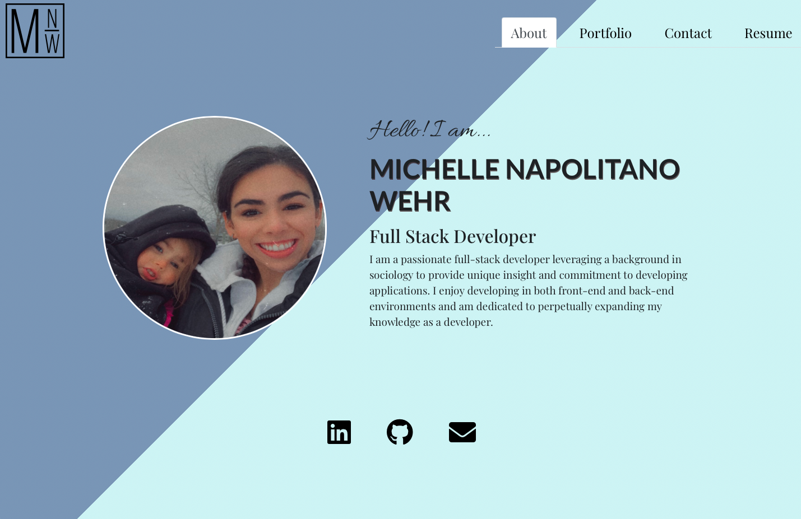
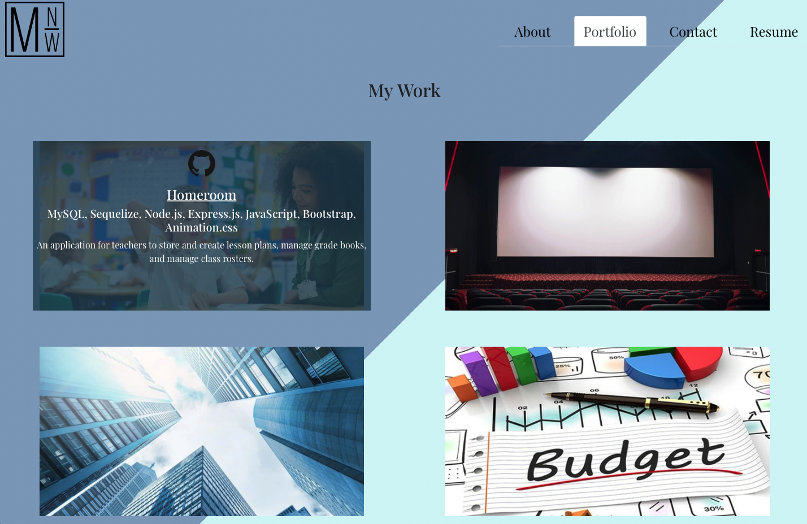
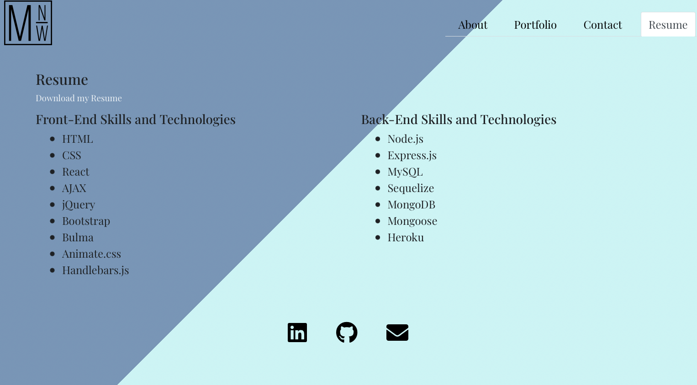
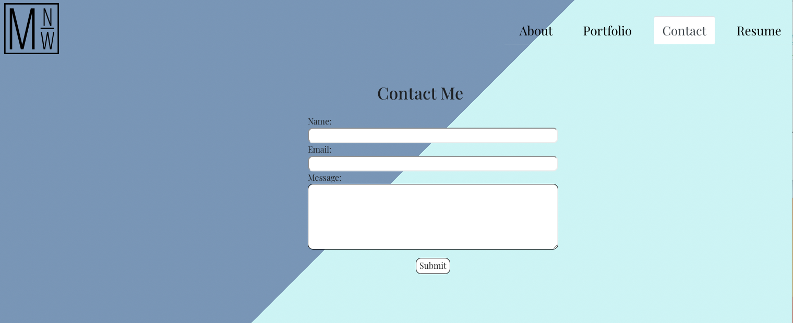

# React Portfolio

## Description

- Built with react, in this portfolio, I introduce myself as a developer and showcase my projects. Included is a contact form that sends an email to my email address with the written message. I also included a link to my resume and skills as both a front-end and back-end developer.

## Installation

Simply click the link to view my portfolio.

## Usage

This application is intended to showcase my professional self as a developer, including projects that I have completed and links to the deployed projects and github repositories. There is a contact form that users can fill out which then sends an email to my email address by use of emailjs. I also have included a resume tab with a list of my skills as developer and link to a pdf of my resume.

## Built with:

- React
- JavaScript
- CSS
- Animate.css

## This application can be found:

- [Deployed Application](https://michellewehr.github.io/react-portfolio-2/#contact)
- [Repository](https://github.com/michellewehr/react-portfolio-2)

## Contribution

This is a personal portfolio, so contribution is closed at this time.

## Author

Michelle Napolitano Wehr
[GitHub Profile](https://github.com/michellewehr/)
